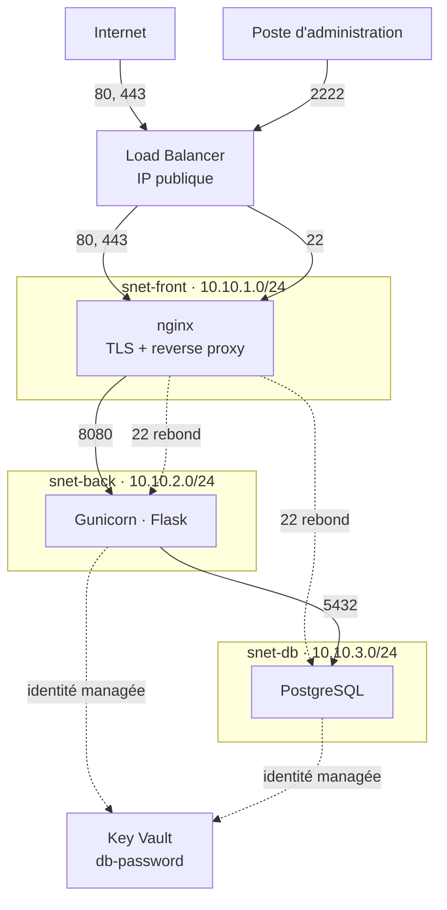

# azure-3t-iac

> Dépôt principal et pipelines CI/CD : https://gitlab.com/rpaul17/azure-3t-iac

Déployer une application web dans le cloud aboutit souvent à des ressources trop exposées, des secrets éparpillés dans le code et les pipelines, des permissions trop larges, et une infrastructure que personne ne sait reconstruire.

Ce projet déploie une application trois tiers (web, applicatif, base de données) sur Azure en appliquant le principe du moindre privilège : réseaux segmentés où chaque tier n'atteint que ce dont il a besoin, identités sans secret limitées au strict nécessaire, et secrets gérés hors du code.

L'infrastructure entière se reconstruit depuis zéro en une quinzaine de minutes, sans aucune intervention manuelle, et chaque règle d'isolation est vérifiée par un script rejouable.

## Architecture



Le load balancer est l'unique point d'entrée public. Aucune machine virtuelle ne possède d'adresse publique : l'accès administratif passe par une règle de traduction vers le front, puis par rebond SSH vers les autres tiers. Chaque subnet est protégé par son propre groupe de sécurité réseau, en refus par défaut, doublé d'un pare-feu local sur chaque machine.

Le mot de passe de la base est généré par une ressource éphémère Terraform et transmis à Key Vault par un argument write-only : il ne transite ni par l'état Terraform ni par les journaux. Les machines le lisent via leur identité managée, avec un accès restreint à ce seul secret. Aucun identifiant n'est stocké nulle part.

## Comment le lancer

### Prérequis

- un abonnement Azure et la CLI `az` authentifiée
- Terraform, Ansible et `jq`
- les collections Ansible : `ansible-galaxy collection install -r ansible/requirements.yaml`
- une clé SSH, dont le chemin est renseigné dans `terraform/terraform.tfvars`

### Préparation, une seule fois

L'identité utilisée par la pipeline vit en dehors de l'infrastructure applicative, pour qu'une destruction ne la supprime pas.

```bash
cd terraform/bootstrap
terraform init
terraform apply
```

### Déploiement

```bash
cd terraform
cp terraform.tfvars.example terraform.tfvars   # puis ajuster les valeurs
terraform init -backend-config=backend.hcl
terraform apply
```

```bash
cd ansible
./inventory/generate-inventory.sh
ansible-playbook site.yml
```

L'inventaire Ansible est généré à partir des sorties Terraform : adresses, port d'administration, plages de subnets et coordonnées du coffre suivent automatiquement chaque redéploiement.

Comptez environ quatre minutes pour l'infrastructure et dix minutes pour la configuration.

### Vérification

```bash
./tests/check-isolation.sh
```

### Destruction

```bash
cd terraform
terraform destroy
```

L'infrastructure est conçue pour être éphémère : créée, démontrée, détruite. Le coût réel se limite aux heures d'utilisation.

## Vérification de l'isolation

Le script rejoue la matrice de flux sur l'infrastructure déployée et compare chaque résultat à celui attendu. Un flux qui doit être bloqué est un test à part entière : il échoue s'il devient joignable.

```bash
> ./tests/check-isolation.sh

Network isolation checks
  [OK]   front -> back:8080           pass
  [OK]   front -> db:22               pass
  [OK]   back -> db:5432              pass
  [OK]   front -> db:5432             fail
  [OK]   back -> db:22                fail
  [OK]   db -> back:8080              fail

External exposure checks
  [OK]   LB:2222 ssh                  pass
  [OK]   LB:5432 postgres             fail
  [OK]   LB:8080 app                  fail

HTTP endpoint checks
  [OK]   LB:80 /healthz               200
  [OK]   LB:80 / redirect             301
  [OK]   LB:443 /health               200
  [OK]   LB:443 /db                   200

0 check(s) failed
```

## Contrôles automatisés

Chaque `push` déclenche une pipeline qui vérifie le code avant tout déploiement : détection de secrets, format et validité Terraform, `tflint`, analyse de sécurité `checkov`, `ansible-lint`, puis un `terraform plan`.

La pipeline s'authentifie auprès d'Azure par OpenID Connect et auprès de l'état Terraform par un jeton de job : aucun secret n'est stocké côté GitLab. Son identité ne dispose que d'un rôle en lecture seule, si bien qu'elle ne peut, par construction, rien modifier ni détruire. Toute application est faite manuellement.

## Documentation

| Document                               | Contenu                                                           |
| -------------------------------------- | ----------------------------------------------------------------- |
| [Architecture](docs/architecture.md)   | Découpage réseau, matrice de flux, dimensionnement, load balancer |
| [Configuration](docs/configuration.md) | Rôles Ansible, durcissement, services déployés                    |
| [Sécurité](docs/security.md)           | Choix de conception, contrôles automatisés, vérifications         |
| [Coût](docs/cost.md)                   | Modèle éphémère et garde-fous budgétaires                         |

## Limites connues

- **Base de données sur machine virtuelle** : en production, un service managé apporterait sauvegardes, correctifs et haute disponibilité sans administration système.
- **Pas de pare-feu applicatif** : un WAF filtrerait les attaques applicatives devant le reverse proxy. Écarté pour des raisons de coût et de périmètre.
- **Certificat auto-signé** : faute de nom de domaine, le chiffrement est en place mais l'identité du serveur n'est pas attestée par une autorité.
- **Coffre accessible publiquement, mais filtré** : un point de terminaison privé le retirerait totalement d'internet, au prix d'une facturation horaire et d'une zone DNS privée.
- **Trafic interne non chiffré** entre le reverse proxy et l'application, et entre l'application et la base : il circule sur un réseau privé segmenté.
- **Front non redondant** : le quota de l'abonnement limite l'infrastructure à trois machines.
  Le détail et la justification de chaque compromis figurent dans la documentation.

## Technologies

Azure, Terraform, Ansible, nginx, PostgreSQL, GitLab CI.

## Licence

MIT. Voir [LICENSE](LICENSE).
